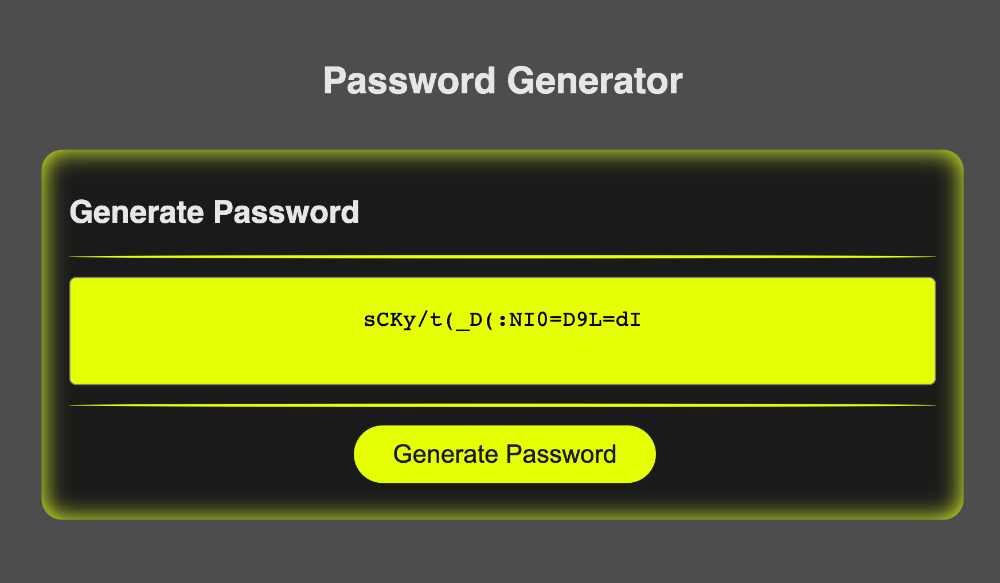

# Module 3 Challenge

## Password Generator

## The goal of this project is to create passwords of different complexities
- The user presses a button to generate a password.
- Once the button is pressed the user is presented with several prompts that allow the user to specify the password requirements including lowercase, uppercase, numeric, and special
- Password length has to be between 8 and 128 characters
- At least one character type has to be selected
- The password is generated with the user inputs
- Password is shown on the screen for the user to copy

[Live Site](https://suedepritch.github.io/psychic-lamp/)

